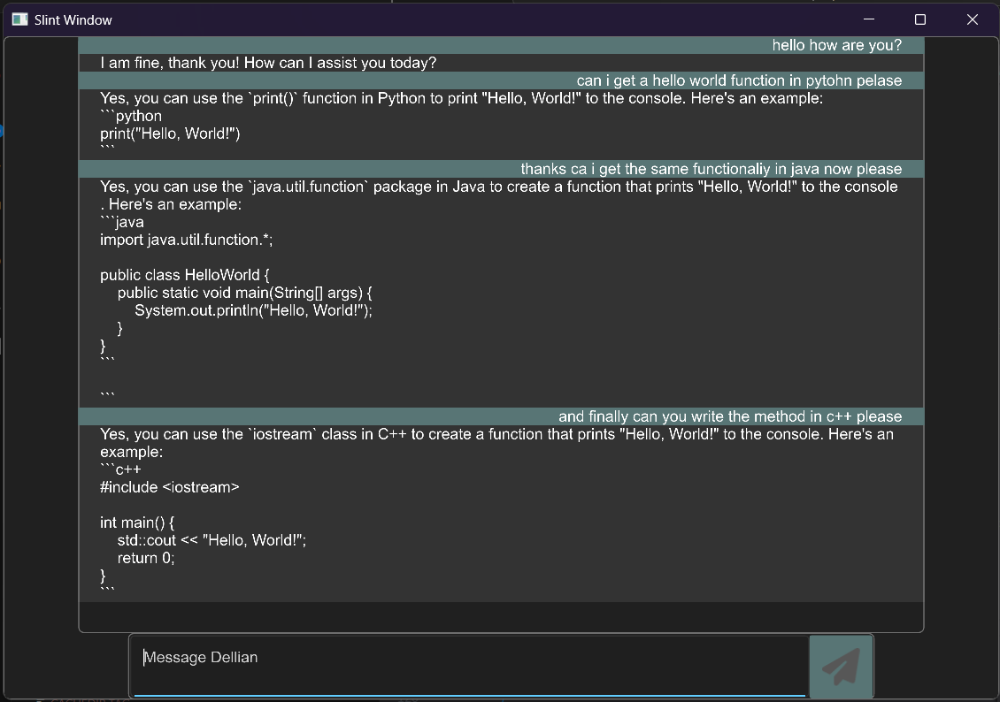

# Experiments-With-Rust-LLMs
## Rust-based ONNX Runtime and LLM Experiment

This repository contains my first attempt at building a solution using **Rust** to run ONNX models, with a focus on **LLMs (Large Language Models)**. This project serves as a learning experience as I explore the Rust language, memory management concepts like `Arc`, and the safe/unsafe paradigms within Rust.

## Project Overview

The current version of the project is a **work-in-progress** and serves as an experimental bridge to:

- Learn Rust's syntax, structure and understanding the ARC thread/memory management methods.
- Experiment with **ONNX runtime** for running small LLMs.
- Work with **Slint**, a GUI framework, to create an interface.

The model currently in use is sourced from the [**Qwen-0.5B-Instruct**](https://huggingface.co/Qwen/Qwen2-0.5B-Instruct) on Hugging Face. At present, the model, ONNX runtime, and GUI are all part of the same codebase, which is **not the final solution**. Eventually, I plan to separate the ONNX-based model into an API, and have the Slint-based GUI act as a client for better architecture.

## Example

## Goals and Improvements

- Transition the model execution to an API service.
- Resolve **undefined behavior (UB)** in the current model-related code and struct handling.
- Refine the project to improve Rust-specific design and **memory safety**.
- Develop a cleaner and modular structure for the Slint-based GUI.
- **Substitute ONNX runtime** with **OpenVINO**, allowing the LLM to run on **Intel integrated graphics** for improved performance.

## Future Vision

In the **far future**, I aim to build a **framework** that allows users to dynamically select the **specialized language model (SLM)** for their task. This would enable better model selection based on the nature of the work, for example:

- A **coding-tuned** model for programming tasks.
- A **grammar-helper** model for language-based tasks.

The ultimate goal is to offer flexibility, where users can pick models that best align with their needs, improving response accuracy and task suitability.

## Future Work

This project will continue to evolve as I learn more about Rust and refine the overall solution. For now, it's a minimal setup designed to help me grasp:

- **ONNX runtime** for ML model inference (with plans to move to **OpenVINO**).
- GUI development using **Slint**.
- Rust's approach to **memory management** and **concurrency** via `Arc`.

Feedback and suggestions are welcome!
